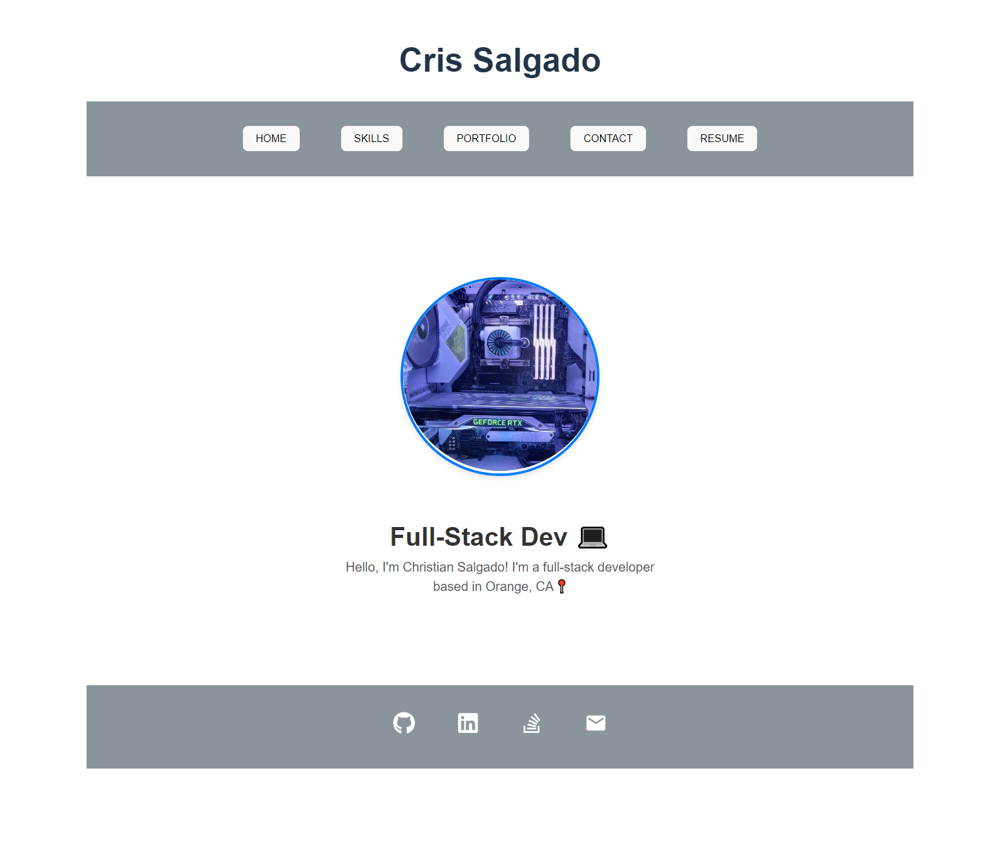

## Portfolio-React

  # License
  
  
## Description
  
  - My updated portfolio created with React!

  

  
  
## Features
  
  - Checkout my projects

  - Checkout the skills I learned

  - Download resume
  
  - contact me!
  
## Questions
  
  - https://github.com/crissal2
  
  - salgado.chris.m@gmail.com
  